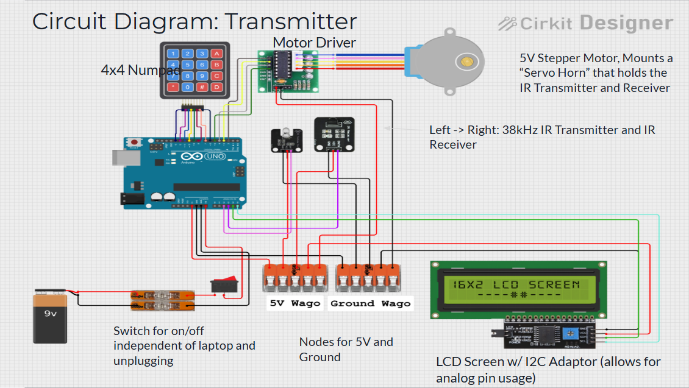
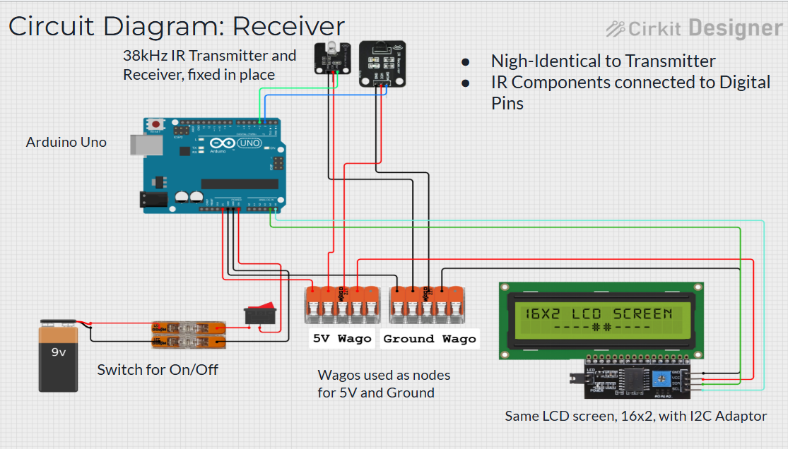
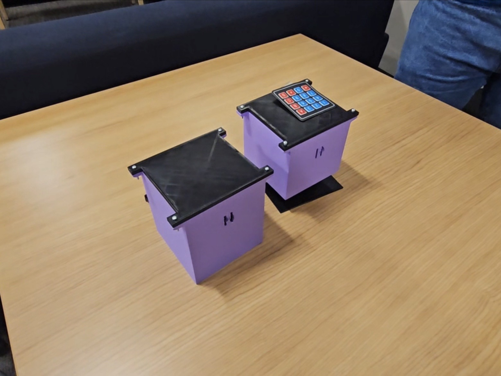
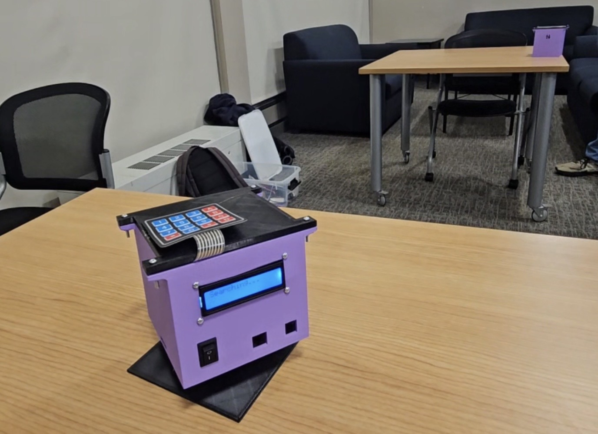

# Point-to-Point Optical Communication System

A wireless, line-of-sight optical communication system that establishes a secure, localized data link between an automated tracking transmitter and a stationary receiver. The system operates entirely without radio frequencies (RF) or Bluetooth, using a highly directional infrared beam for alignment and data transfer.

## Overview
This project implements a free-space optical communication link designed to securely transmit data across a distance without electromagnetic interference.

### Key Constraints & Design Parameters
* Spatial Alignment: Assumes both devices are placed on roughly the same horizontal plane, facing each other within a 90° initial angular window.
* Transmission Range: Capable of reliably transmitting up to a 10-digit decimal number over a minimum distance of 10 feet (3 meters).
* Beam Collimation: The optical signal is deeply recessed inside a custom physical enclosure slit. This prevents wide-radius "blasting," narrowing the signal into a precise directional beam so that automated alignment detection functions accurately.
* Medium: 100% wireless and completely free of RF/Bluetooth radiation.

---

## How It Works
The system follows a strict state machine sequence from initialization to data delivery. To reset the link or initiate a new transmission at any stage, the units must be power-cycled.

[Power On] ──> [Transmitter Sweeps 90°] ──> [Link Established] ──> [Enter Keypad Data] ──> [Data Transmitted] ──> [Manual Power Reset]
                                                   │
                                     (If Link Fails / Error Occurs)
                                                   ▼
                                             [Idle Error State]

* Simultaneous Power-On: Power on both devices at roughly the same time (exact synchronization is not required, but they should be turned on within a reasonable window).
* Automated Search & Alignment: The transmitter enters a sweeping routine, panning its optical head to scan the 90° field of view. Once it detects the receiver's feedback alignment signal, it halts rotation and locks the physical link.
* Data Entry: The user inputs up to a 10-digit decimal number via the transmitter's 4x4 matrix keypad.
* Transmission: The data is modulated into an optical payload and transmitted across the free-space link. The receiver demodulates the payload and renders the value onto its display.
* System Reset: If any step fails, the system enters an Idle Error State. To attempt a new transmission or clear an error, both devices must be manually powered off and back on.

---

## Features
* Key Design Features:
  * Binary Encoding: Translates numerical input into raw data utilizing deliberately timed infrared (IR) pulses.
  * Majority-Vote Decoding: Implements an algorithmic voting approach on the receiver to reduce noise sensitivity from ambient or fluorescent light.
  * Stepper Motor-Assisted Scanning: Employs precise hardware panning loops to achieve accurate optical signal alignment.
  * Modular System Architecture: Divided cleanly by engineering design blocks (Input -> Processing -> Transmission -> Output).
* On-Board Diagnostics: Real-time system status updates (such as "Searching..." or link confirmation) are fed directly to an integrated 16x2 I2C LCD screen.
* Matrix Interface Input: Dedicated physical numeric keypad allowing standalone data entry independent of a serial monitor.
* Localized Power Architecture: Independent rocker switches decouple the units from computer host cables, allowing true standalone deployment.

---

## Hardware Architecture & Components

### Wiring Diagrams
The electrical connections are optimized for low-profile routing using compact terminal blocks for power and ground rails.

| Transmitter Configuration | Receiver Configuration |
| --- | --- |
|  |  |

### Component Bill of Materials & Cost Breakdown

| Component | Quantity | Estimated Unit Cost | Subtotal |
| --- | :---: | :---: | :---: |
| Arduino Uno Microcontroller Boards | 2 | $27.60 | $55.20 |
| 5V Unipolar Stepper Motor (28BYJ-48) + ULN2003 Driver | 1 | $4.89 | $4.89 |
| 16x2 Character LCD Screen with I2C Module | 2 | $10.49 | $20.98 |
| 4x4 Matrix Membrane Keypad | 1 | $6.85 | $6.85 |
| 38kHz IR Transmitter LED & Receiver pair | 1 | $7.90 | $7.90 |
| 3D Printed Structural Enclosures (PLA Material) | — | $18.50 | $18.50 |
| Hardware & Components (Wago blocks, Rocker switches, M3 hardware) | — | $18.09 | $18.09 |
| **Total Estimated System Cost** | | | **$132.41** |

---

## CAD Enclosure Design
The physical structure was engineered to ensure strict geometric symmetry and signal isolation. Both enclosures share an identical height profile and base footprint area, keeping the optical transceivers perfectly level with one another even with the motor stack integrated under the transmitter.

The internal electronics are housed inside clean, modular 3D-printed boxes:
* `transmitter.png` / `receiver.png`: The main structural boxes. The optical hardware is deeply recessed within the shell, firing out of a restrictive vertical slit to create a highly directed beam.
* `mount.png`: The automated base assembly. The entire transmitter enclosure sits directly on top of a stepper coupling connected to this base, allowing it to pan smoothly across the surface.
* `lid.png`: Low-profile friction-fit or bolt-down covers keeping internal power buses securely contained.

---

## Technical Specs & Performance
* Operating Voltage: 5V DC (regulated via on-board Arduino linear regulators from 9V battery sources).
* Current Draw Metrics:
  * Transmitter Search Mode: 420 mA total (Microcontroller: 50 mA, Stepper Motor: 320 mA, LCD: 50 mA).
  * Transmitter Idle/Typing Mode: 100 mA total (Microcontroller: 50 mA, LCD: 50 mA).
  * Receiver Active/Idle Mode: 100 mA total (Microcontroller: 50 mA, LCD: 50 mA).
* Battery Lifespan (Standard 580 mAh 9V):
  * Transmitter Unit: ~1.38 hours under continuous searching active motor loops.
  * Receiver Unit: ~5.80 hours of continuous runtime.
* Target Transmission Range: Designed for >=3.0 meters (Exceeded in benchmarks up to 3.8 meters / 12.5 feet without data degradation).
* Acquisition Field of View: 90-degree horizontal panning tracking window.
* Alignment Detection Time Range: Variable depending on relative orientation, operating within a 0 to 30 second acquisition sweep window.
* Protocol & Bit Modulation: Custom direct-binary serialization operating at a 10 Hz pulse rate over a 38kHz hardware carrier wave. Employs a 200 ms high active start pulse, immediately followed by a raw 34-bit data payload container (50 ms high active pulse per bit separated by 50 ms low active inter-bit gaps).
* Payload Capacity: 34 total bits, safely supporting a 10-digit decimal integer maximum value (0 <= N <= 9,999,999,999).
* Transmission Time: Exactly 3.6 seconds to fully fire, collect, and verify the complete 34-bit payload package.
* System Accuracy:
  * Detection Success Rate: 95% automated alignment path detection success under target ceiling lighting boundaries.
  * Data Transmission Accuracy: 100% bit-accurate translation across established line-of-sight locks.

---

## Acknowledgements
This project was developed as part of the ENG EK 210 course curriculum at Boston University during the Spring 2026 semester.